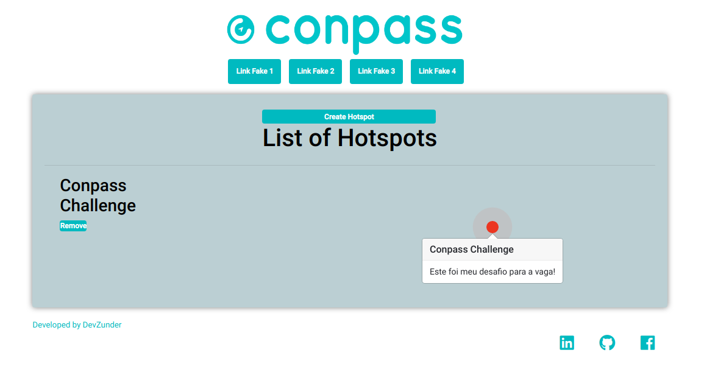

## Projeto para a vaga da Compass

Este projeto foi desenvolvido pelo Developer Lucas Zunder para aprovação na vaga de React Developer na Conpass.
Consiste basicamete em um app de onboarding para plataformas.

Permitindo o usuário ao clicar em adicionar um hotspot, inspecionar a tela e posteriormente selecionar um ponto da tela para adicionar um HotSpot.



Posteriormente abrirá um popover onde o usuário pode escrever um título e conteúdo para o popover.

## Como instalar e executar

Em um terminal com Git instalado, basta executar os seguintes comandos:

```bash
git clone https://github.com/devzunder/compasschallenge.git
cd myreads
npm install
npm start
```

O projeto fica disponível por padrão em http://localhost:3000/

## Estrutura do projeto

```bash
├── README.md - This file.
├── package.json
├── public
│   ├── favicon.ico
│   └── index.html
└── src
    ├── actions
    │   └── hotspots.js
    │
    ├── assets
    │   └── logo.png
    │
    ├── components
    │   ├── App.js
    │   ├── Footer.js
    │   ├── Header.js
    │   ├── Hotspot.js
    │   └── Hotspots.js
    │
    ├── middlewares
    │   ├── index.js
    │   └── logger.js
    │
    ├── reducer
    │   ├── index.js
    │   └── hotspots.js
    │
    ├── utils
    │   └── api.js
    ├── index.css
    ├── index.js
    └── store.js
```
